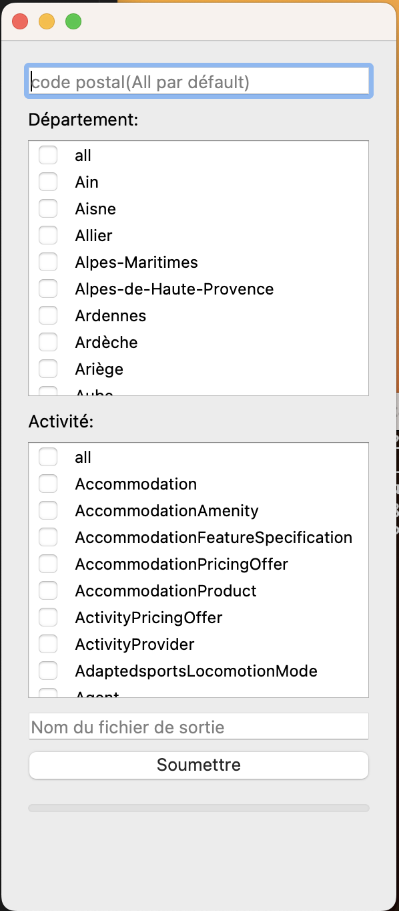
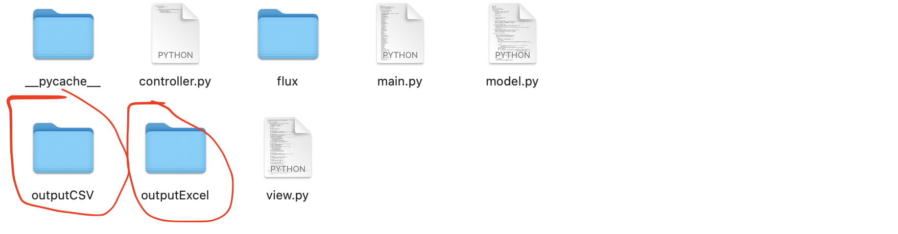
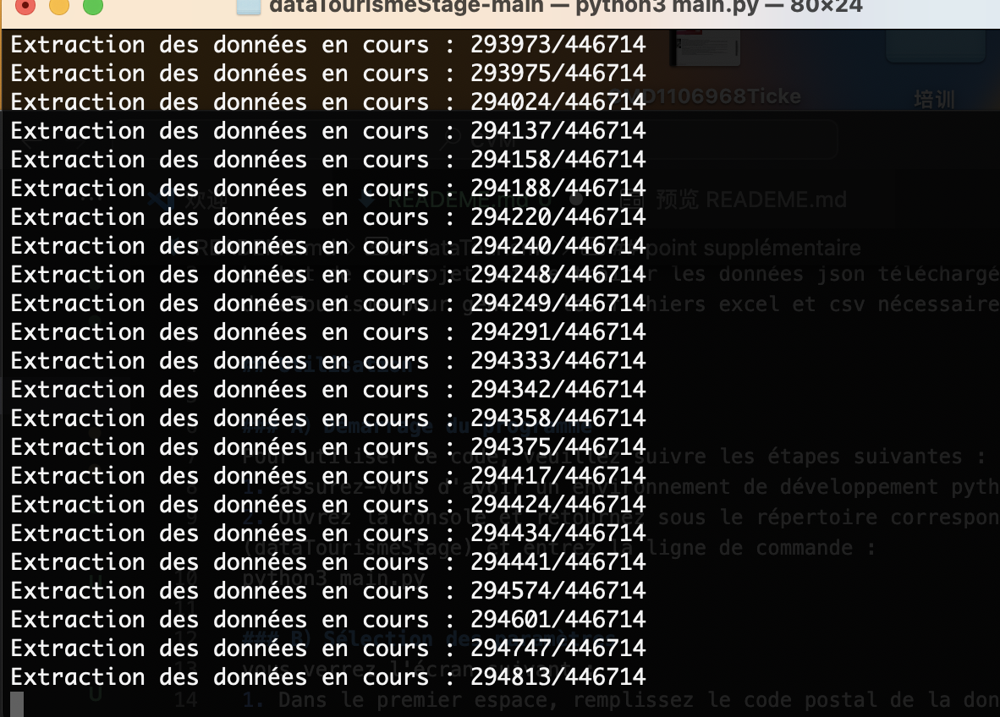
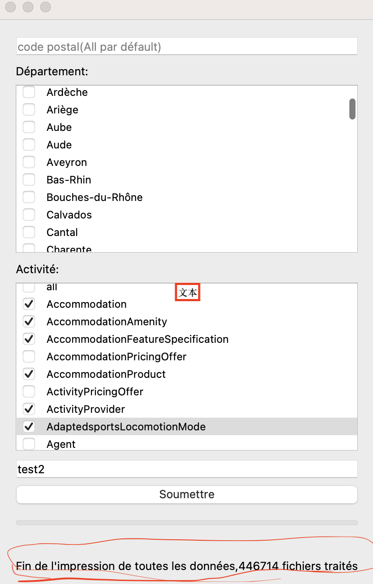
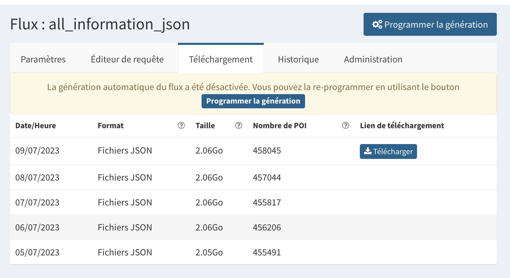
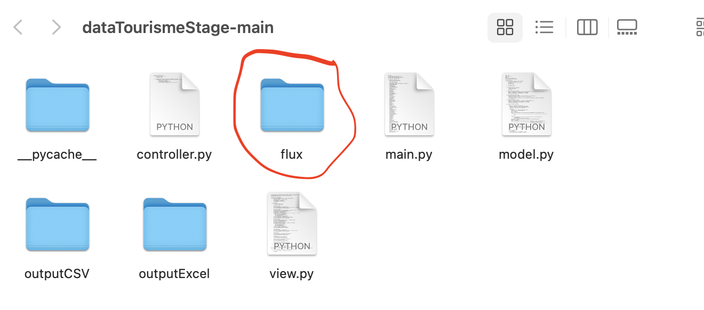

# dataTourismeStage
Ce projet a pour objectif de traiter les données JSON téléchargées de dataTourisme pour générer des fichiers Excel et CSV.

## Utilisation

### A) Démarrage du programme
Pour utiliser ce code, veuillez suivre les étapes ci-dessous :
1. Assurez-vous de disposer d'un environnement de développement Python.
2. Ouvrez la console, naviguez jusqu'au répertoire correspondant ((dataTourismeStage-main), puis exécutez la ligne de commande suivante :
```bash
python3 main.py
```
### B) Sélection des paramètres
Une fois le programme lancé, vous verrez l'interface suivante :

1. Dans le premier champ, indiquez le code postal des données que vous souhaitez extraire. Si vous ne remplissez pas ce champ, toutes les données associées à tous les codes postaux seront sélectionnées par défaut.

2. Dans le deuxième champ, vous pouvez sélectionner les données dont vous avez besoin en fonction du département. Une sélection multiple est possible.

3. Le troisième champ vous permet de sélectionner l'activité des données dont vous avez besoin. Encore une fois, une sélection multiple est possible.

4. Dans le dernier champ, vous pouvez nommer le fichier CSV et le fichier Excel à exporter. Il n'est pas nécessaire d'ajouter une extension à ces noms.

### C） Accès aux fichiers CSV et Excel générés
Le fichier CSV généré se trouve dans le répertoire `outputCSV`. De même, le fichier Excel se trouve dans le répertoire `outputExcel`.



## Points supplémentaires

### A) Suivi de la progression du programme

1) La progression de la génération du document est affichée dans le terminal. Notez que cela peut prendre un certain temps.

2) Lorsqu'un message apparaît sur le terminal indiquant "Fin de l'impression de toutes les données : XXX fichiers traités", cela signifie que l'exécution du programme est terminée.


### B) Sources et mises à jour des données

1) Les données de datatourisme sont mises à jour quotidiennement. Vous pouvez consulter le lien ci-dessous pour télécharger les données les plus récentes. Assurez-vous de télécharger les données au format JSON.
URL de téléchargement des données : [https://diffuseur.datatourisme.fr/fr/flux](https://diffuseur.datatourisme.fr/fr/flux)


2) Si vous souhaitez traiter les nouvelles données téléchargées pour générer des fichiers CSV et Excel, supprimez d'abord le fichier `flux` dans le répertoire `dataTourismeStage-main`. Ensuite, renommez votre répertoire JSON nouvellement téléchargé en `flux`, placez-le dans `dataTourismeStage-main`, puis ré-exécutez le programme.

